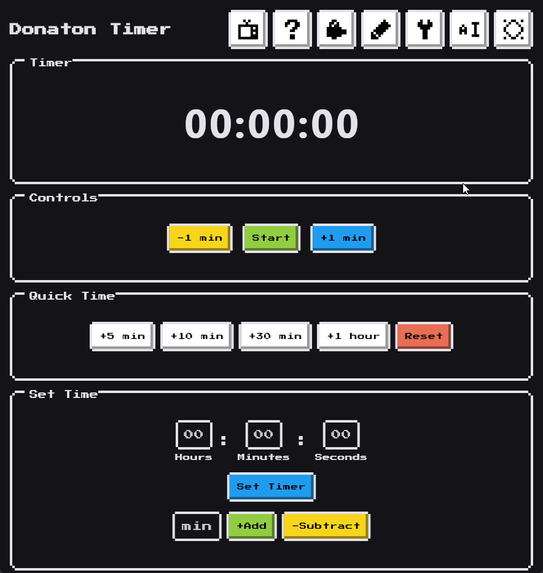
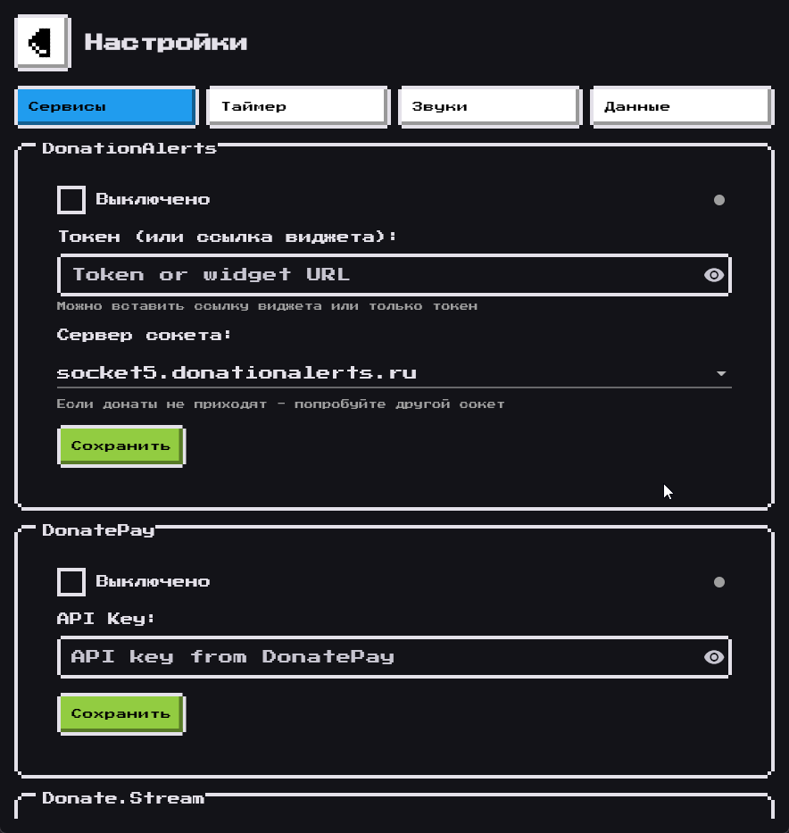
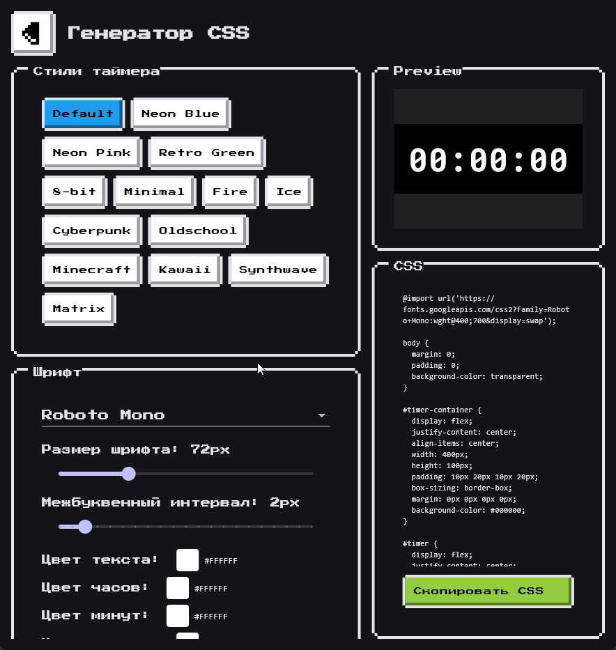

# Таймер для донатона | Donathon Countdown Timer

  [](https://github.com/MjKey/DonatonTimer/)  

**DonatonTimer** — приложение для управления таймером донатона, которое интегрируется с несколькими донат-сервисами, позволяя отслеживать и управлять временем в зависимости от поступивших донатов. Также присутствует **оверлей таймера** для OBS с кастомизируемыми стилями!

> Это моя первая разработка приложения на Flutter, до этого писал только на Python, думаю, получилось неплохо, пользуйтесь!
>
> Будет полезно тем, кто хочет себе удобный и функциональный таймер для донатона!

**Автор:** [MjKey](https://mjkey.ru)  
**Поддержать проект:** [CloudTips](https://pay.cloudtips.ru/p/cf634f74) • [Dalink](https://dalink.to/mjk3y)

---

## Инструкция в Wiki

✦ [RU Wiki](https://github.com/MjKey/DonatonTimer/wiki/Настройка-и-использование-%5BRU%5D)
✦ [EN Wiki](https://github.com/MjKey/DonatonTimer/wiki/Setting-and-using-%5BEN%5D)

---

## Скриншоты

### Главный экран
*Управление таймером и статистика*


### Настройки
*Подключение сервисов донатов*


### CSS Генератор
*Кастомизация оверлея для OBS*


---

## Поддержка сервисов

|     Сервис     | Статус |  Комментарий  |
|:--------------:|:------:|:-------------:|
| DonationAlerts |   Да   |   Работает    |
| Donate.Stream  |   Да   |   Работает    |
| DonatePay      |   Да   |   Работает    |
| DonateX        |   Да   |   Работает    |
| Donatty        |   Да   |   Работает    |
| Streamer.bot   |   Да   |   BETA VER    |
| iHAQ Donate    |   Нет  |   В планах    |
| StreamElements |   Нет  |   В планах    |

## Что нового в v3.0.X

- **Мульти-сервис** — DonationAlerts, DonatePay, Donate.Stream, DonateX, Donatty одновременно
- **CSS генератор** — кастомизируемый оверлей для OBS с Google Fonts
- **Раздельные цвета** — часы, минуты, секунды могут быть разных цветов
- **Анимации** — pulse, glow, bounce, blink для текста и разделителей
- **Мобильное управление** — контроль таймера через QR код
- **Звуковые уведомления** — оповещения о донатах
- **Автосохранение** — таймер сохраняется при закрытии
- **Ретро UI** — стильный 8-bit интерфейс (nes_ui)
- **Выбор сокета** — для DonationAlerts можно выбрать socket/socket1-5
- **Парсинг URL** — можно вставить ссылку виджета вместо токена
- **Streamer.bot** — интеграция через WebSocket с гибкой привязкой событий к суммам донатов
- **Конвертация** — конвертация валют в RUB
- **Фиксированное время** — режим фиксированного времени за каждый донат
- **Режим убавления времени** — таймер можно настроить на убавление времени от донатов

---

## Ключевые возможности

### Интерфейс программы под Windows
- Ретро 8-bit стиль
- Тёмная и светлая тема
- Удобное управление
- Индикаторы статуса подключения
- Тултипы с подсказками при наведении на кнопки

### Веб-интерфейс для управления таймером
- Старт/Стоп таймера
- Изменение времени на таймере
- Отображение последних донатов
- Отображение топ донатеров

### Управление таймером с телефона
- Доступ к веб-интерфейсу с мобильных устройств
- QR код для быстрого подключения
- Удобное управление в мобильной версии

### Интеграция с донатами
- Автоматическое прибавление времени от доната
- Настройка — сколько рублей = 1 час
- Поддержка нескольких сервисов одновременно
- Интеграция со Streamer.bot (события -> суммы донатов)

### CSS генератор стилей
- 14 готовых пресетов (Cyberpunk, Matrix, Kawaii и др.)
- Google Fonts
- Анимации текста и разделителей
- Раздельные цвета для HH:MM:SS

### Мини-версия для Dok-Панели OBS
- Упрощённый интерфейс для использования в dok-панели OBS

---

## Установка и запуск

### Установка релизов

1. **Скачайте установочный файл:**
   - Перейдите в раздел [Releases](https://github.com/MjKey/DonatonTimer/releases) и скачайте последнюю версию `DonatonTimer_vX.X.X_Setup.exe`

2. **Запустите установочный файл:**
   - Дважды щелкните по скачанному файлу и следуйте инструкциям на экране

### Установка артефактов (сырых версих / альфа версих если они есть)

1. **Скачайте последний артефакт:**
   - Перейдите в раздел [Actions](https://github.com/MjKey/DonatonTimer/actions), выберите последний удавшийся билд (с галочкой)
   - Снизу будет Artifacts -> Latest — скачиваем, разархивируем в любую папку
   - **ТОЛЬКО ДЛЯ ТЕСТИРОВАНИЯ, ЭТО НЕ РЕЛИЗЫ!**

2. **Запустите таймер**

---

## Использование

### URL адреса (по умолчанию)

| URL | Назначение |
|-----|------------|
| `http://localhost:7575/timer` | Оверлей таймера для OBS Browser Source |
| `http://localhost:7575/dashboard` | Веб-панель управления |
| `http://localhost:7575/mini` | Мини-версия для dok-панели OBS |

> **Старые порты:** В версиях до v3.0.6 использовались порты 8080 (HTTP) и 4040 (WS). При первом запуске приложение предложит автоматически переключиться на новые порты 7575/3434.

### Настройка dok-панели OBS

В OBS Studio -> Dok-панели -> Пользовательские dok-панели браузера

### Настройка Streamer.bot

Подробная инструкция в [Wiki](https://github.com/MjKey/DonatonTimer/wiki).

Кратко:
1. В Streamer.bot включите **WebSocket Server** (Servers/Clients -> WebSocket Server -> Auto Start)
2. В DonatonTimer -> Настройки -> Streamer.bot укажите адрес WebSocket (по умолчанию `ws://127.0.0.1:8080/`)
3. Включите сервис и нажмите **Сохранить**
4. Добавьте привязки событий: укажите Source (например, `Twitch`), Type (например, `Sub`) и эквивалентную сумму доната

---

## Хранение данных

Настройки хранятся в:
```
%APPDATA%\MerryJoyKeyStudio\DonatonTimer\data.json
```

---

## Порты по умолчанию

| Порт | Назначение |
|------|------------|
| 7575 | HTTP сервер (OBS оверлей) |
| 3434 | WebSocket (мобильное управление) |

> Старые порты 8080/4040 были изменены для предотвращения конфликтов со Streamer.bot.

---

## Вопросы и поддержка

Если у вас есть вопросы или вы столкнулись с проблемами, не стесняйтесь открыть issue на [GitHub](https://github.com/MjKey/DonatonTimer/issues).

## Лицензия

Этот проект лицензируется под лицензией MIT — см. [LICENSE](LICENSE) для подробностей.

---

## Сборка из исходного кода

```bash
# Клонировать репозиторий
git clone https://github.com/MjKey/DonatonTimer.git
cd DonatonTimer

# Установить зависимости
flutter pub get

# Запустить
flutter run -d windows

# Собрать релиз
flutter build windows
```

### Сборка установщика

```bash
# Собрать приложение
flutter build windows

# Собрать установщик (требуется Inno Setup 6)
"C:\Program Files (x86)\Inno Setup 6\ISCC.exe" setup.iss
```

---

**Обратный отсчёт для донатона**

---

Made by [MjKey](https://mjkey.ru) with ❤️
Буду рад любой финансовой поддержке!
